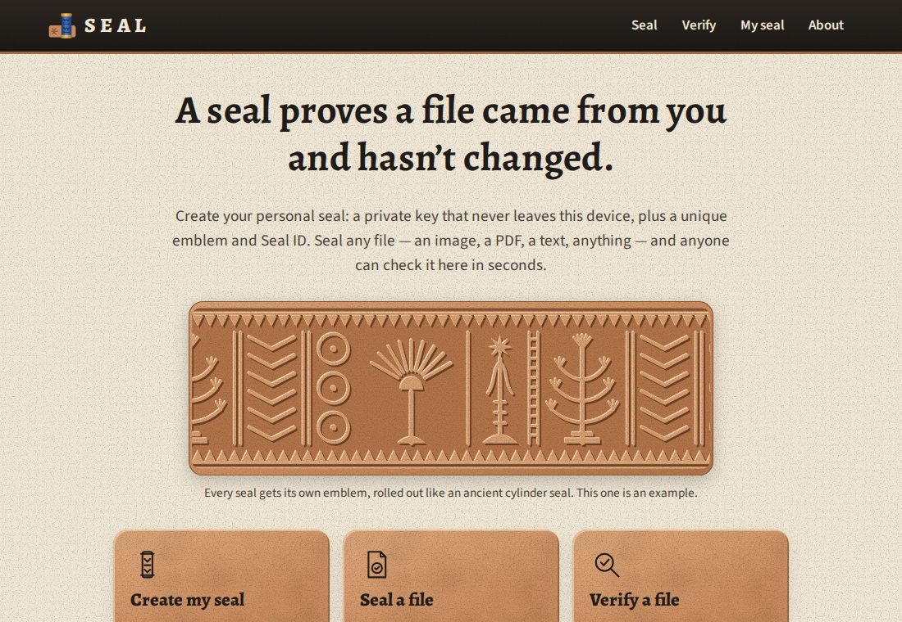
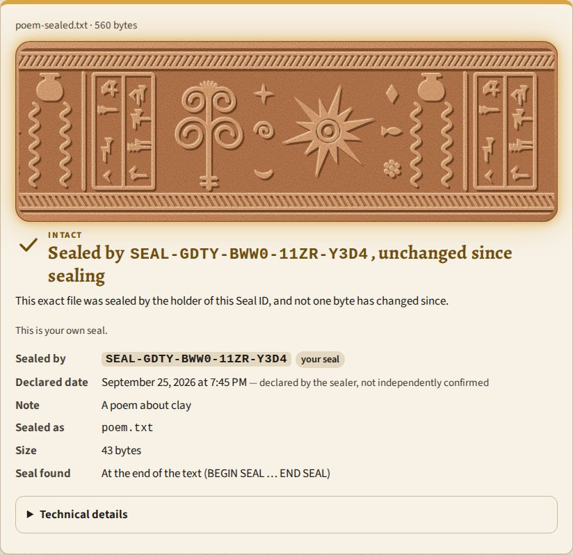
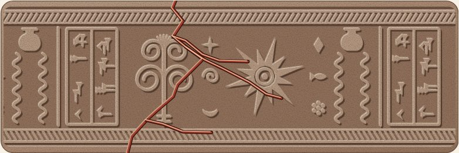

# SEAL — personal seals for your files

For thousands of years, people in Mesopotamia signed clay with **cylinder
seals**: small carved stones rolled across wet clay, leaving a picture only
their seal could make. SEAL does the same for digital files, with modern
cryptography instead of carved stone.

SEAL is a free, static web app. There is no server, no account and no
tracking. Everything happens in your browser, and your files are never uploaded.

- **Create your seal**: a private signing key that never leaves your device,
  plus a unique emblem and a Seal ID (like `SEAL-7K3M-Q9XA-2PDF-W4HN`) derived
  from its public key.
- **Seal any file** — image, PDF, text, anything. SEAL signs a fingerprint of the file.
- **Verify any sealed file**: drop it in and see at once whether it's intact,
  and whose seal it carries.



## What a seal proves — and what it doesn't

This is shown in the app, on the home and verify screens. Please read it before
relying on a seal.

**A seal proves:**

- This exact file was sealed by the holder of this Seal ID.
- The file has not changed since it was sealed — not one byte.

**A seal does not prove:**

- That a human made it, or that no AI was used.
- Who the person behind a Seal ID is — unless they publicly announce their Seal
  ID, for example in their social media bio.
- The sealing date. The date is declared by the sealer, not independently
  confirmed.

**Limits:**

- Social platforms re-compress uploaded images. That changes the file and
  breaks the seal. Seals work for files shared as they are: email attachments,
  "send as document", websites, cloud drives.
- Losing your private key (and its backup) means losing your seal. Browsers can
  also clear site data — Safari does after 7 days without a visit, unless the
  app is on the home screen — so keep your backup file.

SEAL never says "verified human" or "authentic". It says *sealed by
`SEAL-…`* and *unchanged since sealing*.

## How to use it

### Create your seal

1. Open SEAL and choose **Create my seal**.
2. Choose a passphrase (at least 12 characters; four or more random words work
   well). SEAL downloads an encrypted backup, `seal-backup-SEAL-….json`. You can
   check right away that the backup opens with your passphrase.
3. Confirm you saved the backup somewhere safe that isn't only this device.
   Only then is your seal stored in the browser, locked so the key can sign but
   can never be copied out, not even by you.
4. Your emblem is rolled out and your Seal ID is shown.

To use your seal on another device, choose **Restore from a backup** there and
open your backup file with your passphrase.

### Seal a file

Drop a file on **Seal a file**, add an optional note (up to 280 characters),
and check the date. The date is prefilled with "now", and it is *your
declaration*: people will see it as "declared by the sealer". Then choose where
the seal goes:

| File type | Where the seal goes |
|-----------|---------------------|
| PNG images | Inside the image, in a metadata chunk. The picture isn't changed. |
| Plain text and Markdown | At the end of the text, between `-----BEGIN SEAL-----` and `-----END SEAL-----` lines ("clear-sealed"). Windows/Mac line endings may change without breaking it; any other edit breaks it. |
| Everything else (JPEG, PDF, video, zip…) | In a small separate file, `<name>.seal`. The file itself is untouched. Share both together. |

You can always choose a separate `.seal` file instead of embedding. SEAL gives
you a "How to verify" line to send along with the file.

### Verify a file

Drop the file on **Verify a file**, together with its `.seal` file if it came
with one. You can also paste clear-sealed text. You'll see one of:

| Result | Meaning |
|--------|---------|
| **Intact** (the impression glows) | Sealed by `SEAL-…`, unchanged since sealing. |
| **Altered** (the impression cracks) | The seal is genuine, but this file has changed since it was sealed — or the seal belongs to a different file. |
| **Invalid seal** | The seal's signature doesn't match its contents: it was edited, damaged or forged. It tells you nothing. |
| **No seal found** | No seal inside the file, and no `.seal` file added. |
| **Revoked** | A revocation notice from the seal's owner was provided (or remembered): don't trust this seal. |





**Known seals.** Save the Seal IDs of people you know ("Priya — SEAL-…").
Future verifications show the name, labelled "saved by you". Names stay on your
device.

### Announce your Seal ID

A Seal ID is anonymous until you say it's yours. Put it where people already
know you, for example:

- your social media bio: `Files I publish are sealed with SEAL. My Seal ID: SEAL-XXXX-XXXX-XXXX-XXXX`
- your website's About page, or your email signature
- next to files you publish ("sealed by SEAL-…")

The emblem makes your seal easy to recognise at a glance, but anyone checking
carefully should compare the **Seal ID** (or the full fingerprint, under
*My seal → Details*). You can download your emblem as SVG, as a band or a round
stamp for a profile picture.

### If your key is lost or stolen: revocation

In **My seal**, create a **revocation notice**, a small file signed by your
key that says "stop trusting this seal". Make one now and keep it with your
backup: once the key is lost you can't make one any more. Publish it only if
you need to, for example next to your Seal ID. There is no server, so people
only learn about a revocation if you publish the notice. When someone adds it
while verifying (or has told SEAL to remember it), the result is marked
**Revoked**.

## Privacy and security

- **No network.** SEAL is static files. Its Content-Security-Policy
  (`default-src 'none'; script-src 'self'; …`) forbids third-party scripts,
  inline code, and any connection to another site. Fonts are self-hosted. The
  test suite fails if the app makes any request to another site.
- **Your key.** Keys are Ed25519, made by the browser's built-in Web Crypto. No
  custom cryptography is involved. The private key is extractable only long
  enough to write the encrypted backup. It is then re-imported as a
  **non-extractable** key and stored in IndexedDB, and the extractable copy is
  dropped.
- **The backup** is encrypted with AES-256-GCM, using a key derived from your
  passphrase with PBKDF2-SHA-256 and 600,000 iterations and a random salt and
  IV. All the readable fields in the file are authenticated too. Its strength
  depends on your passphrase.
- **What's stored on your device:** the locked private key and public key,
  names you saved for known seals, and revocation notices you chose to remember.
- **Honest limits:** non-extractable means the key can't be *copied*. Any code
  running on the page while it's open could still *use* it. Only use SEAL from a
  copy you trust (you can host your own, see below), and keep your browser up to
  date. JavaScript can't guarantee that secrets are wiped from memory.
- **Weak keys are refused.** At least one mainstream browser's Web Crypto
  accepts a "small-order" public key that makes forged signatures verify, so
  SEAL rejects those keys itself (see `docs/FORMAT.md` §2).

## Formats

The formats are open, so anyone can write a verifier. The short version:

- **Seal ID** = `SEAL-` + Crockford base32 of the first 80 bits of SHA-256(public key).
- **Manifest** (canonical JSON: sorted keys, no whitespace, UTF-8):
  `{"v":1,"alg":"Ed25519","pub":…,"sha256":…,"size":…,"name":…,"declared_at":…,"note":…}`.
  The signature is Ed25519 over those bytes.
- **`.seal` file**: `{"manifest": {…}, "sig": "…"}`.
- **PNG**: the seal object in an `iTXt` chunk with keyword `seal`. The hash
  covers the PNG with that chunk cut out, so the chunk can sit anywhere.
- **Text**: NFC + LF-normalized text, then the BEGIN/END SEAL block with the
  base64url seal object.

The precise rules, edge cases, backup format and complete worked examples are in
**[docs/FORMAT.md](docs/FORMAT.md)**.

## Browser support

SEAL needs a browser with Ed25519 in Web Crypto: current versions of Chrome,
Edge, Firefox and Safari, on desktop and mobile (roughly Chrome/Edge 137+,
Firefox 129+, Safari 17+). On older
browsers SEAL shows a message asking you to update, and does nothing else.
There is no fallback crypto library.

## Hosting and running locally

SEAL is plain static files with no build step: `index.html`, `css/`, `js/`,
`fonts/`, `img/` and `manifest.webmanifest`. It must be served over HTTP(S),
because ES modules don't load from `file://` and Web Crypto needs a secure
context (`localhost` counts).

- **Locally:** `npm start` (or `node tests/serve.mjs 8080`), then open
  http://localhost:8080/. Any static server works, e.g. `python3 -m http.server`.
- **GitHub Pages:** in the repository settings, go to *Pages* → *Deploy from a
  branch*, pick the branch and `/ (root)`. The `.nojekyll` file makes Pages
  serve the files as they are. GitHub Pages can't send custom headers, so the
  security policy comes from the `<meta>` tag in `index.html`. That covers
  everything except `frame-ancestors`.
- **Netlify / Cloudflare Pages:** the `_headers` file adds the same policy as
  real HTTP headers, plus `frame-ancestors 'none'`, `nosniff` and a strict
  referrer policy.

## Development and tests

```sh
npm install          # Playwright (headless Chromium) and axe-core, for tests only
npm test             # unit tests in the browser, then end-to-end UI tests
npm run test:unit
npm run test:e2e
```

If you don't already have a Playwright Chromium, run `npx playwright install chromium` first.

- **Unit tests** (`tests/*.test.js`, run in headless Chromium from
  `tests/index.html`) cover:
  - seal then verify is INTACT for PNG, JPEG, PDF, text, binary and empty files
  - a change to any byte gives ALTERED, including every byte of a small file
    and the PNG signature, chunk lengths, types and CRCs
  - swapping the public key, editing the date, note, name or any other field,
    or damaging the signature gives INVALID SEAL
  - text canonicalization: CRLF/LF/CR and NFC/NFD verify identically; every
    other edit, and text appended after the block, breaks the seal
  - PNG: the seal chunk can move, any pixel change breaks the seal, re-encoding
    drops it, damaged or duplicate chunks are invalid
  - emblem and Seal ID determinism against golden values computed in Node.js
  - backup: right passphrase, wrong passphrase, tampered fields, weak settings
  - the stored key is non-extractable and every export attempt fails
  - RFC 8032 Ed25519 and FIPS SHA-256 vectors, the weak-key blocklist, and the
    documented format examples
- **End-to-end tests** (`tests/e2e.mjs`) drive the real UI. They create a seal
  with its backup, seal text, PDF and PNG files, and check every result state,
  pasted text, revocation, restoring on a second device, known seals, backup
  re-export and delete. They also check reduced motion, phone layouts
  (390 and 320 px), keyboard navigation and a browser without Ed25519. They run
  axe-core (WCAG 2.2 AA rules) on every screen and state, and fail on any
  console error, CSP violation or request to another site.
- **Design pages:** `tests/gallery.html` (random emblems) and
  `tests/motif-sheet.html` (every motif).

### Manual checks before a release

Automated tests run in Chromium. Before relying on a new version, go through
this list by hand in current **Chrome, Firefox and Safari**, on desktop and on
a phone (iOS Safari, Android Chrome):

- [ ] Create a seal; the backup downloads; "Check that my backup works" succeeds.
- [ ] Reload the page: the seal is still there (My seal shows the same Seal ID).
- [ ] Seal a PNG (embedded), a text file (embedded), and a PDF or JPEG (`.seal`); all downloads arrive with the right names.
- [ ] Verify each: Intact. Edit one (e.g. re-save the image): Altered.
- [ ] Restore the backup in another browser: same Seal ID and emblem.
- [ ] Verify a file sealed in one browser in another: same emblem, same Seal ID.
- [ ] Revocation notice + sealed file: Revoked.
- [ ] Keyboard only: every screen can be used with Tab, Enter and Space; focus is visible.
- [ ] Screen reader (VoiceOver / NVDA): result headlines and states are announced.
- [ ] Reduced motion setting: no rolling animation.

## Project structure

```
index.html            the whole app (screens are sections), strict CSP
css/                  styles (tokens, clay textures, dark mode, reduced motion)
js/lib/               the core, no DOM: encodings, canonical JSON, Ed25519,
                      Seal ID, manifests, sealer, verifier, PNG, text, backup,
                      keystore, passphrase hint, emblem generator
js/ui/                screens, rolling-seal animation, verification visuals
fonts/                Alegreya and Source Sans 3 (SIL Open Font License)
img/                  procedural textures (SVG noise) and the icon
docs/FORMAT.md        the format specification
tests/                browser test harness, unit tests, E2E tests, design pages
```

## Not included (yet): independent timestamps

The optional stretch goal, OpenTimestamps proofs to confirm the sealing date
independently, is **not implemented**. It needs network calls to public
timestamp servers and a Bitcoin block source, which conflicts with SEAL's
no-network policy. It deserves a careful, opt-in design. Until then, every date
SEAL shows is labelled *declared by the sealer*. If you need an independent
date today, you can timestamp a `.seal` file yourself at
[opentimestamps.org](https://opentimestamps.org); SEAL does not check such
proofs.

## Credits

- Fonts: [Alegreya](https://github.com/huertatipografica/Alegreya) and
  [Source Sans 3](https://github.com/adobe-fonts/source-sans), both under the SIL
  Open Font License (see `fonts/`).
- Emblem motifs are original geometric designs, inspired by the general style of
  ancient Near Eastern cylinder seals. They are not copies of any specific object.

No license has been chosen for SEAL's own code yet. That is the repository
owner's decision.
